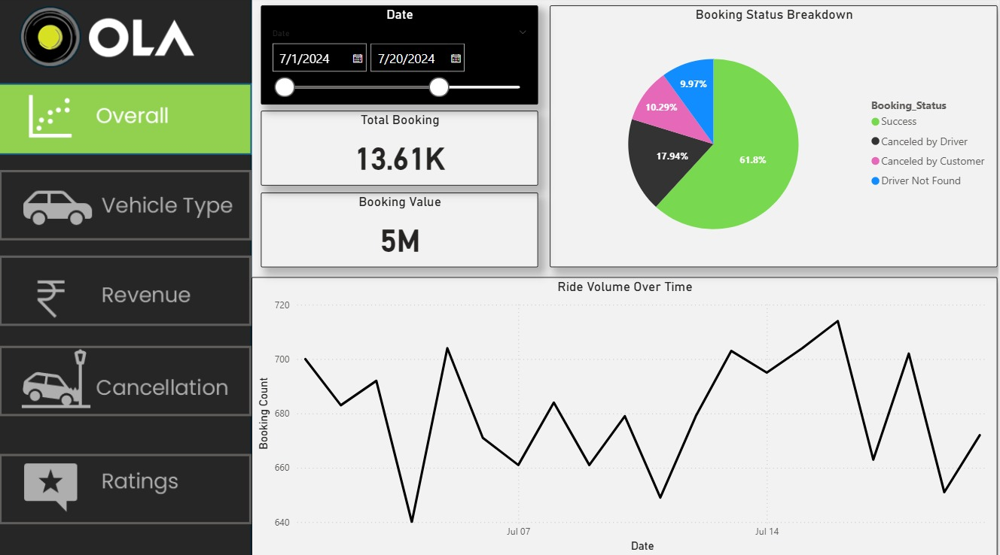
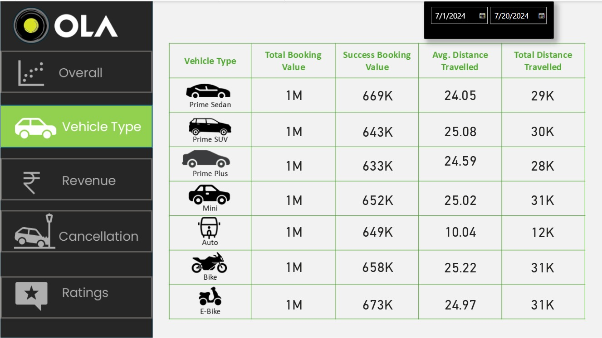
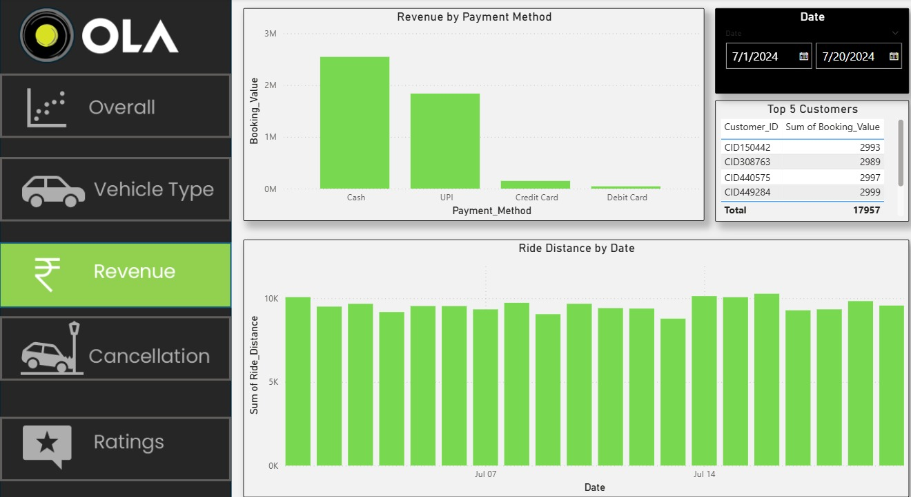
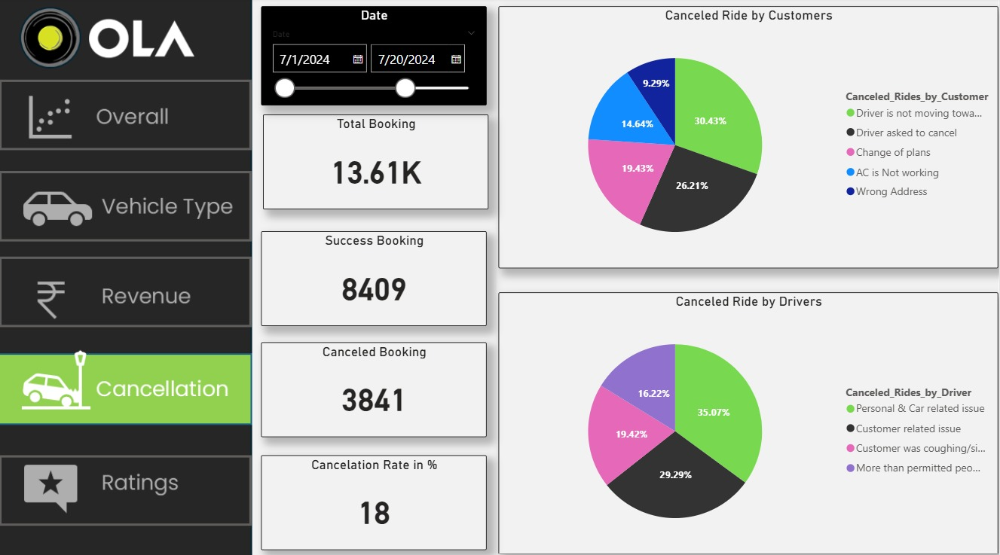
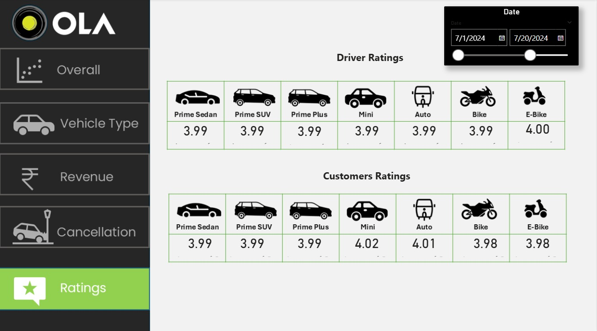

🚖 Ola Ride Data Analysis

  

  

  

  

  

📊 Project Overview
Performed an in-depth analysis of ride-booking data to uncover patterns in demand, cancellations, and driver performance.

🔍 Key Insights & Analysis

📅 Analyzed ride demand trends over time

❌ Identified cancellation patterns and reasons

🚗 Evaluated driver performance metrics

⏰ Tracked peak booking hours and high-demand zones

📍 Studied location-based ride distribution

🛠️ Tools & Technologies

🗄️ SQL

📊 Power BI

💡 Business Impact

📉 Reduced ride cancellations

🚀 Improved driver allocation efficiency

📊 Enhanced overall customer experience
